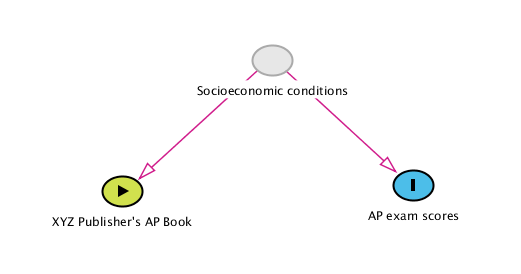
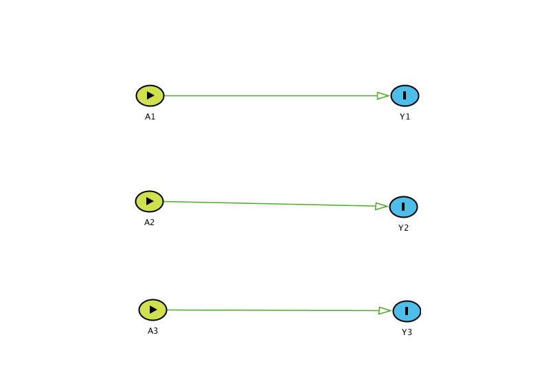
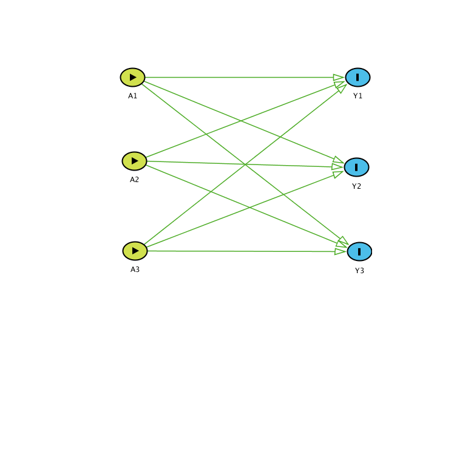
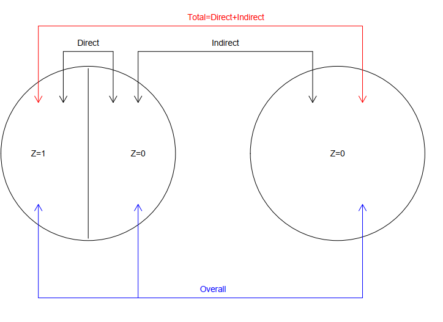

```{r setup, include=FALSE}
knitr::opts_chunk$set(echo = TRUE)

library(tidyverse)
library(inferference)
library(wesanderson)
library(lme4)
library(broom.mixed)

my_palette <- wes_palette("Moonrise3")


theme_set(theme_minimal())
```
## Introduction 

Causal Inference, a branch of statistics, enables us to make quantitative and qualitative conclusions about the effect of a particular exposure or treatment on how the treatment alone affects a study subject's results. The standard methods of causal inference uses the Stable Unit Treatment Value Assumption (SUTVA), which requires that the exposure of one individual not affect the outcome of another. The presence of interference - that is, the phenomenon when one person getting treated affects another person's outcome - invalidates this assumption. This post investigates how we can adapt our repertoire of methods from Causal Inference to situations with interference. 

## What is Causal Inference?

Say we want to find out how a particular treatment affects the outcome of a situation. This could be the result of a drug trial, or the effect of a policy on how it affected the public. We could try and find out how those who got treated differed from those who did not. This can be done by a simple linear regression of the form $Y \sim A$ and seeing if the coefficient on A is statistically significant. At this point one is reminded of the ubiquitous mantra "Correlation does not imply causation". What if the treated population is just fundamentally different from those that were untreated?

We can express our dilemma using the figure below. What if instead of the treatment, $A$, affecting the outcome, $Y$, directly, there is some hidden variable that we do not account for in our analysis? In the situation represented by the graph below, XYZ publisher could claim that using their books leads to higher scores in AP exams by showing a statistical correlation, when the underlying reality is that students with higher family incomes tend to buy XYZ Publisher's books, and they're also the ones getting better AP scores on average. 




Causal Inference deals with this dilemma, of trying to find only how one particular variable (the treatment) affects the outcome in a situation of interest. We now introduce the conceptual framework for how a causal inference analysis is done. 

For a particular subject in a study, assume we can either treat them, or not. Let the treatment be represented by $A$, with $A=0$ representing no treatment, and $A=1$ representing treatment. Then the person with have an outcome $Y$, which might or might not vary depending on $A$. In reality we only see $Y|A=1$ or $Y|A=0$. Let $A = a$, where $a \in \{0,1\}$. A variable which denotes the possible outcomes for both treatment values can then be represented as $Y^a$. We refer to $Y^a$ as the potential outcome. 

Each person's potential outcomes can have *two* values, the treated value ($Y^{a=1}$) and the untreated value ($Y^{a=0}$). We can find the causal effect of treatment on one individual by calculating $Y^{a=1}-Y^{a=0}$. We can average this over all individuals to find the average causal effect, that is, $$ACE = E[Y^{a=1}]-E[Y^{a=0}]$$

Note that of the two potential outcomes, only one is observed in reality. There are different ways in which we can find the value for the missing potential outcome . We subsequently discuss one particular method of achieving this using randomization of treatment, but there are other techniques such as Inverse Probability Weighting that can be used to this end (Hernan and Robins, 2020). 

A crucial idea in causal inference is that of **exchangeability**. If the individuals in either of the treatment groups (control or treated) have the same characteristics, one would expect them to have the same outcomes if they get the same treatment. We say that exchangeability holds in this case. This can be expressed as $Y^a \perp \!\!\! \perp A$ - the actual distribution of potential outcomes for the population is independent of the treatment. As long as we can ensure exchangeability holds between treatment groups, we can use the actual observed outcomes instead of the potential outcomes, half of which are not observed in reality. When exchangeability holds, the average causal effect becomes $E[Y|A=1]-E[Y|A=0]$. 

One way to achieve exchangeability is by randomizing the treatment assignment. Since treatments are randomly assigned, we are assured that on average, a similar population is represented in both the treated and control groups. 

### Causal Inference Assumptions

In the above process for causal interference we must make the Stable Unit Treatment Value Assumption, or **SUTVA** (Rubin, 1980, as cited in Hernán and Robins, 2020). SUTVA has two requirements:

- The treatment value of one individual does not affect the potential outcome of another individual. In other words, there is no **interference**. 

- There are not different types of exposure (for example, when two people both receive the treatment, it is not the case that one of them gets a medicine that is past the due date). 

What happens if SUTVA does not hold? Say we have a setting like a vaccine study, where after a particular number of people get vaccinated, others are much less likely to get a communicable disease because of herd immunity. In this case the first assumption of SUTVA - that of no interference - does not hold. It turns out that potential outcomes are not binary in such a situation. This project investigates what strategies can be adopted to study causal effects in situations with interference. 


## Causal Inference with Interference

As we defined earlier, interference is said to occur if the potential outcomes of one individual depend on the treatment value of another individual. The causal graphs below demonstrate a situation without interference and with interference. 

First, we see a situation without interference. The effect of treatment on individual $1$, $A_1$, only affects the outcome of individual $1$. The same is true for individuals $2$ and $3$.


In a situation with interference, we see that the treatment of individual $1$, affects the outcome of all individuals present ($Y1$, $Y2$, and $Y3$). We can see how much more complicated our graph becomes in the presence of interference even when we have just three observations in the system. 


We can carry out causal inference in settings with interference if we make a few simplifying assumptions. They are as follows: 

- The population of individuals is divided into groups, where each group receives one of two treatment strategies, represented by $Z$.  An example of this: in one group, 10% of the people receive treatment, whereas 80% receive treatment in the other group. Note that each individual treatment is assigned randomly within a group, that is, the treatment strategy merely tells us how much of the group gets the treatment, not who gets it.

- Partial interference holds, that is, there is no interaction between individuals in different groups. In other words, people located in different groups cannot influence each other's potential outcomes. Intuitively, one could think of individuals located in different cities - what treatment someone receives in Saint Paul is not going to affect someone in Chicago.  

A consequence of interference is that each individual now has more than two potential outcomes, since they will either get treated or not treated, their neighbor (for lack of a better term) will get treated or not treated, and so on. Thus there are $2*2*2*2... =2^{number \ of \  group \ members}$ outcomes. Note that assumption (1) reduces the number of potential outcomes to $2^{number \ in \ group}$, instead of $2^{total \ population}$ in the absence of groups. 

Note that since the potential outcomes are not dichotomous for a particular individual in the setting of interference, we use *average* potential outcomes instead, represented by $\overline{Y^a}$ (Hudgens and Halloran, 2008). For example, let us assume there are 10 people in a group where the treatment strategy states that 60% of the population get treated. Then let us consider a particular individual in the group. They either get treated  or they don't get treated. For each treatment value of this individual, there are $2^9$ possible variations for the other people in the group, which by definition of interference affect the potential outcome value of our person of interest. This is why we define an average potential outcome, where we average over all the potential outcomes of the individual. Thus, $\overline{Y^{a=1}}$ tells us what is the average potential outcome when the individual got treated, while we vary the treatment values for the remaining nine people in the group, and $\overline{Y^{a=0}}$ tells us the same thing when the individual does not get the treatment. 


With these assumptions, we now define what causal effects we seek to find.  We represent the status quo treatment strategy by $Z = \epsilon$ (the control), and the other treatment strategy by $Z = \zeta$ (the treatment). 

1. Direct Effect - For any particular treatment strategy, a specific individual might or might not get treatment. The direct effect compares potential outcomes under treatment when the group's overall treatment assignment $Z$ is fixed: it is the difference in average potential outcomes between those who received treatment, and those who did not, i.e., $$DE = E[\overline{Y^{a = 1}}| Z = \zeta ]-E[\overline{Y^{a = 0}}| Z = \zeta]$$.

2. Indirect Effect (aka Spillover Effect, or Peer Effect) - The indirect effect quantifies the effectiveness of a particular treatment strategy over another one, when a particular subject's treatment value is held constant. This is defined for a specific individual receiving a particular treatment, but whose groups has differing treatment strategies, and then averaged over all study subjects. It can be defined as $$I_0E(\zeta,\epsilon) = E[\overline{Y^{a = 0}} | Z = \zeta]-E[\overline{Y^{a = 0}} | Z = \epsilon]$$. 

We can also define an indirect effect corresponding to receiving treatment, which would be $I_1E(\zeta,\epsilon) = E[\overline{Y^{a = 1}} | Z = \zeta]- E[\overline{Y^{a = 1}} | Z = \epsilon]$.


3. Total Effect (= Direct Effect + Indirect Effect) - The total effect tells us what the causal effect of getting treated in a treatment group is, compared to not getting treated in the control group. It can be expressed as $$TE = E[\overline{Y^{a = 1}} | Z = \zeta]- E[\overline{Y^{a = 0}} | Z = \epsilon]$$ 
Note that this is just $D + I_0$, that is, $TE = D + I_0$.

4. Overall Effect - The overall effect compares the outcomes in the treatment groups to the control groups, i.e., what is the difference in potential outcomes between two treatment strategies. It can be calculated as $$OE = E[\overline{Y^a} | Z= \zeta]-E[\overline{Y^a} | Z=\epsilon]$$.  

The definition for the above described effects are the same as that found in the literature, though we have introduced our own notation (Hudgens and Halloran, 2008; Tchetgen Tchetgen and VanderWeele, 2012)

The following figure illustrates well what the difference is between these 4 effects (Hudgens, 2014). In the figure, the treatment strategy in the treated group was half of the patients receive treatment, and in the control group nobody receives treatment. The direct effect compares the outcomes for different treatment values within the same treatment strategy, whereas the indirect effect compares the outcomes for different treatment strategies for the same treatment value. The total effect is the sum of the direct and indirect effects, whereas the overall effect compares the overall outcomes from one treatment strategy to another. 
While the figure only shows two groups, there is no limitation to the number of groups we can have. 

 

In order to calculate these effects, we first want to make sure exchangeability holds in our treatment groups. This can be done by randomization. In that case, $E[Y^{a=1}]$ and $E[Y | A = 1]$ are the same, and the effects can be calculated from our observed outcomes. We demonstrate these calculations using R in the next section of this post. Note that in the R packages we use in the following section, exchangeability is achieved using inverse probability weighing, which makes use of propensity scores instead of randomizing treatment. 


### Introduce Dataset

We'll be using a package called `inferference` along with its associated data set `vaccinesim`, which details results from a cholera vaccine simulation (Saul and Hudgens, 2017).
```{r}
head(vaccinesim)
```

- Y: Did the subject contract cholera
- X1: Age in decades
- X2: Distance from nearest river
- A: Subject was vaccinated (2/3 of those who participated were vaccinated)
- B: Subject agreed to participate in study
- group: Which neighborhood was the subject in? Different groups were vaccinated at different levels

#### Examine infection levels across variables:

Let's examine how different variables relate to infection

```{r}
vaccinesim %>% 
  ggplot() +
  geom_boxplot(aes(x = as.factor(Y), y = X1)) +
  labs(x = "Infected",
       y = "Age (Decades)",
       title = "Age and Infection")

vaccinesim %>% 
  ggplot() +
  geom_boxplot(aes(x = as.factor(Y), y = X2)) +
  labs(x = "Infected", 
       y = "Distance from River")

vaccinesim %>% 
  ggplot() +
  geom_bar(aes(x = as.factor(A), fill = as.factor(Y)),
           position = "fill") +
  labs(x = "Vaccinated",
       fill = "Infected",
       y = "Proportion") +
  scale_fill_manual(values = my_palette)

vaccinesim %>% 
  ggplot() +
  geom_bar(aes(x = as.factor(group), fill = as.factor(Y)),
           width = 1, 
           position = "fill") +
  labs(x = "Group",
       y = "Proportion",
       fill = "Infected") +
  scale_x_discrete(breaks = c("25", "75", "125", "175", "225")) +
  scale_fill_manual(values = my_palette)
```

Looks like age, distance from a river, vaccination, and group are all associated with infection. 


#### Examine vaccination levels across variables:

Now lets see how different variables relate to vaccination status:

```{r}
vaccinesim %>% 
  ggplot() +
  geom_boxplot(aes(x = as.factor(A), y = X1)) +
  labs(x = "Vaccinated",
       y = "Age (Decades)")

vaccinesim %>% 
  ggplot() +
  geom_boxplot(aes(x = as.factor(A), y = X2)) +
  labs(x = "Vaccinated", 
       y = "Distance from River")


vaccinesim %>% 
  ggplot() +
  geom_bar(aes(x = as.factor(group), fill = as.factor(A)),
           width = 1, 
           position = "fill") +
  labs(x = "Group",
       y = "Proportion",
       fill = "Vaccinated") +
  scale_x_discrete(breaks = c("25", "75", "125", "175", "225")) +
  scale_fill_manual(values = my_palette)
```

Looks like age, distance from river, and group are all associated with whether a subject is vaccinated or not. 


#### Naive Model

To demonstrate the importance of interference, we'll fit a naive model to try and estimate the causal effect of vaccination on infection with Cholera. Based on our data exploration and expert knowledge, we'll include `Age`,  `Distance from River`, and `Group` in our model to give our analysis exchangeability. That is, we think people who are the same age, distance from river, and in the same group are basically the same. We'll also include `Vaccination Status`, and the coefficient on this term will be our causal effect.  

```{r}
set.seed(451)

naive_model <- vaccinesim %>% 
  mutate(group = as.factor(group),
         Y = as.factor(Y),
         A = as.factor(A), 
         B = as.factor(B)) %>% 
  glmer(Y ~ A + X1 + X2 + (1|group), data = ., family = binomial)

summary(naive_model)

glue::glue("\n\n\nOdds Ratio for Vaccination: {exp(summary(naive_model)$coefficients[2,1])}")

prob <- predict(naive_model, data.frame(A = factor(0, levels = c(0,1)), X1 = 2, X2 = 2, group = factor(1, levels = c(1:250))), type = "response") - predict(naive_model, data.frame(A = factor(1, levels = c(0,1)), X1 = 2, X2 = 2, group = factor(1, levels = c(1:250))), type = "response")


glue::glue("\n\n\nChange in Probability for Vaccination: {prob}")

```

Here, we see that the vaccination indicator has a log odds ratio of -0.96, which translates to an odds ratio of about 0.38. This means the vaccine is decently protective. Notably this is on a different scale of units than the interference model will give, which instead reports change in probability of infection. We can get a general idea of the vaccination effect by looking at a given person, here someone who is 20, is 2 units from the river, and is in group 1. To them, the vaccine decreases the probability of infection by 13%. 

As we'll see, this value is similar to that of the direct effect for a moderate vaccination level when allowing for interference, but doesn't allow for understanding how different vaccination levels themselves are protective. It also underestimates the effect of vaccination when very little of your group is vaccinated, and overestimates its effect when most of your group is vaccinated.   


#### Interference Model

Now, we'll begin working on the interference model. This model will allow us to understand how protective vaccination is both for its herd immunity effect and its direct effect on an individual.

Because this is a simulation study, we know the correct model:
```{r slow}
set.seed(451)

correct_model <- interference( formula = Y | A | B ~ X1 + X2 + (1|group) | group, 
  allocations = seq(.2, .8, by = .05), 
  data = vaccinesim, randomization = 2/3, method = 'simple')
```

Model works like this `outcome | exposure | participation ~ covariates | interference group`

- `outcome`: Here, whether or not you were infected with cholera
- `exposure`: Where you given treatment, ie. vaccination
- `participation ~ covariates`: Our model for how people decided whether or not to participate. It varies based on how old they were (`X1`), how far from the river they were (`X2`), and which neighborhood they lived in `(1|group)`.
- `interference group`: Which group that interacts with itself did the subject belong to, here neighborhood


### Effects

#### Direct Effects

```{r}
deff <- direct_effect(correct_model)

deff %>% 
  ggplot(aes(x = alpha2, y = estimate, ymin = conf.low, ymax = conf.high)) +
  geom_ribbon(alpha = 1, fill = "#D1E1EC") +
  geom_line(color = "#6497B1", size = 1) +
  labs(x = "Vaccination Rate",
       y = "Direct Effect (95% CI)",
       title = "Direct Effect of Vaccination")
```

This plot tells us that as the vaccination rate increases in our group, the effectiveness of getting a vaccine decreases. For example, when 20% of your group is vaccinated, the vaccine lowers the probability of catching cholera by 15%. But if 80% of your group is vaccinated, the drop in probability is only ~10%. This makes intuitive sense, as when more people are vaccinated, they are less likely to spread the virus to you, meaning a vaccine has less risk to protect from. 


#### Indirect (Spillover) Effects

```{r}
ieff.5 <- ie(correct_model, allocation1 = 0.5)

ieff.5 %>% 
  ggplot(aes(x = alpha2, y = estimate, ymin = conf.low, ymax = conf.high)) +
  geom_ribbon(alpha = 1, fill = "#D1E1EC") +
  geom_line(color = "#6497B1", size = 1) +
  labs(x = "Comparison Group Vaccination Rate",
       y = "Indirect Effect Relative to 50% Vaccination (95% CI)",
       title = "Indirect Effect of Vaccination relative to 50% Vaccination")
```

Indirect effects are slightly more difficult to understand than direct effects as they compare how effective being in one group versus the other is at protecing you from cholera. Here, we see that relative to a 50% vaccination rate, the chance of catching Cholera if unvaccinated is around 15% higher if you were in a group with a vaccination rate of 20%. As the vaccination rate of the comparison group increases, how protective being in the 50% group is in comparison decreases. 

```{r}
ieff_all <- correct_model$estimates %>% 
  filter(effect == "indirect")

ieff_all %>% 
  ggplot() +
  geom_raster(aes(x = alpha1, y = alpha2, fill = estimate), interpolate = TRUE) +
  labs(x = "Vaccination Rate in Control Group", 
       y = "Vaccination Rate in Comparison Group",
       fill = "Indirect Effect",
       title = "Indirect Effect of Vaccination") +
  scale_fill_gradient2()
```

This is a way to see all of the combinations of vaccination rates at once. Here, as a point gets redder, it means that being in the comparison group relative to the control group is more and more harmful, and the opposite holds true as the color gets bluer. For example, if the control group vaccination rate was 0.8, and the compariosn group vaccination rate was 0.2, then being in the 0.2 group raises the probability of infecting covid by 20%. 

#### Total Effects

```{r}
teff.5_0 <- te(correct_model, allocation1 = 0.5)

teff.5_0 %>% 
  ggplot(aes(x = alpha2, y = estimate, ymin = conf.low, ymax = conf.high)) +
  geom_ribbon(alpha = 1, fill = "#D1E1EC") +
  geom_line(color = "#6497B1", size = 1) +
  labs(x = "Comparison Group Vaccination Rate",
       y = "Total Effect Relative to 50% Vaccination (95% CI)",
       title = "Total Effect of Vaccination relative to 50% Vaccination")
```

Here we can see how the total effect is the sum of the direct and indirect effects. The line is higher than for indirect effects because the vaccine is always helpful, but the effectiveness changes as as vaccination rate in the comparison group increases. 

```{r}
teff_all <- correct_model$estimates %>% 
  filter(effect == "total") %>% 
  filter(trt1 == 0)


teff_all %>% 
  ggplot() +
  geom_raster(aes(x = alpha1, y = alpha2, fill = estimate), interpolate = TRUE) +
  labs(x = "Vaccination Rate in Control Group", 
       y = "Vaccination Rate in Comparison Group",
       fill = "Total Effect",
       title = "Total Effect of Vaccination") +
  scale_fill_gradient2()
```

This plot, interpreted similarly to the indirect effect, shows that at almost all combinations of vaccination rates, taking the vaccine is effective enough to protect people even when switching to groups with lower vaccination rates. 

#### Overall Effects

```{r}
oeff.5 <- oe(correct_model, allocation1 = 0.5)
x <- oeff.5$alpha2
y <- as.numeric(oeff.5$estimate)
u <- as.numeric(oeff.5$conf.high)
l <- as.numeric(oeff.5$conf.low)

overall_effect <- tibble(x, y, u, l)

overall_effect %>% 
  ggplot(aes(x = x, y = y, ymin = l, ymax = u)) +
  geom_ribbon(alpha = 1, fill = "#D1E1EC") +
  geom_line(color = "#6497B1", size = 1) +
  labs(x = "Comparison Group Vaccination Rate",
       y = "Overall Effect Relative to 50% Vaccination (95% CI)",
       title = "Overall Effect of Vaccination relative to 50% Vaccination")
```

Here, we see that independent of vaccination, being in a group with lower vaccination rates is harmful relative to 50% vaccination rates, and higher vaccination rates are protective. 

```{r}

oeff_all <- correct_model$estimates %>% 
  filter(effect == "overall")

oeff_all %>% 
  ggplot() +
  geom_raster(aes(x = alpha1, y = alpha2, fill = estimate), interpolate = TRUE) +
  labs(x = "Vaccination Rate in Control Group", 
       y = "Vaccination Rate in Comparison Group",
       fill = "Overall Effect",
       title = "Overall Effect of Vaccination") +
  scale_fill_gradient2()
```

This visualization shows that across all combinations of vaccination rates, being in a group with a higher vaccination rate is protective irrespective of if you are vaccinated or not. 

## References

